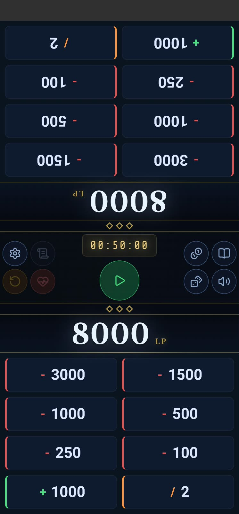
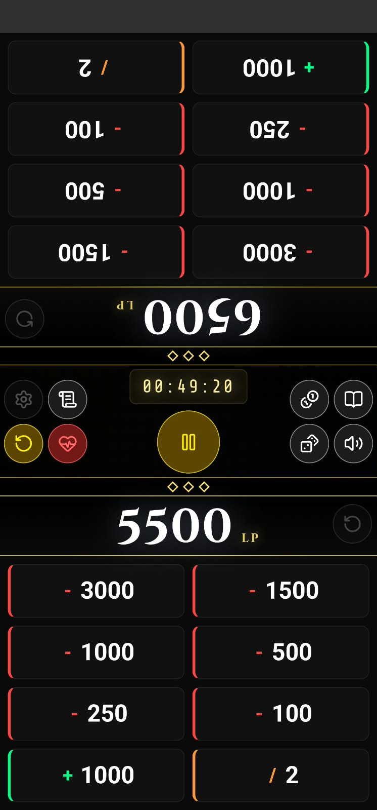
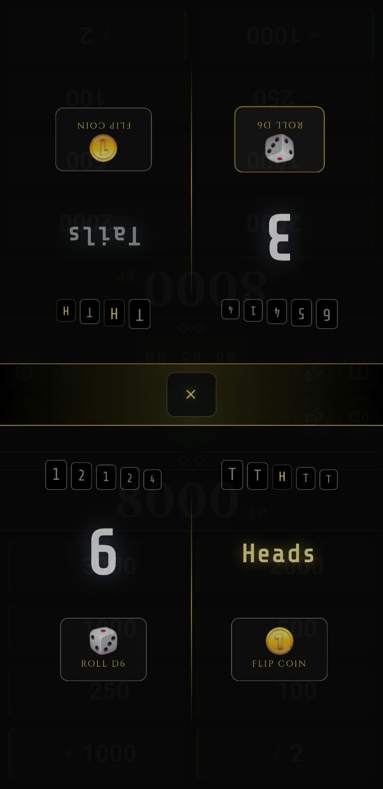
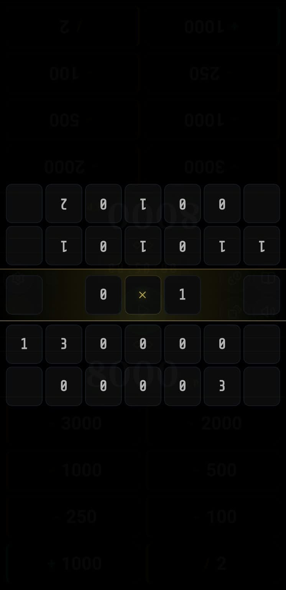
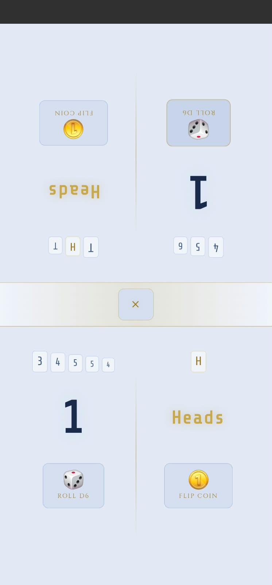
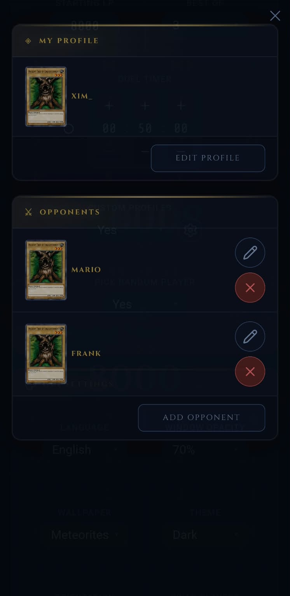
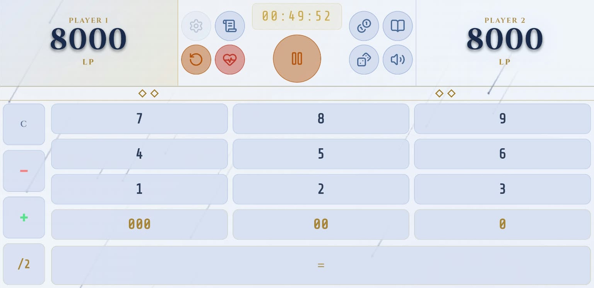
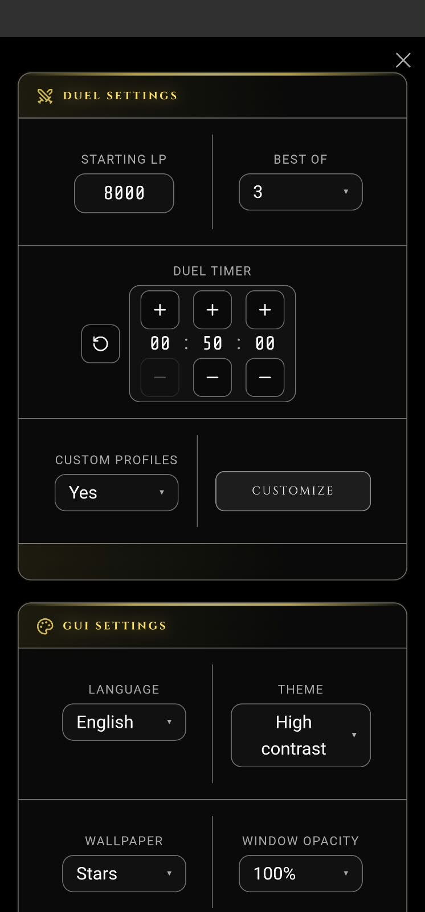
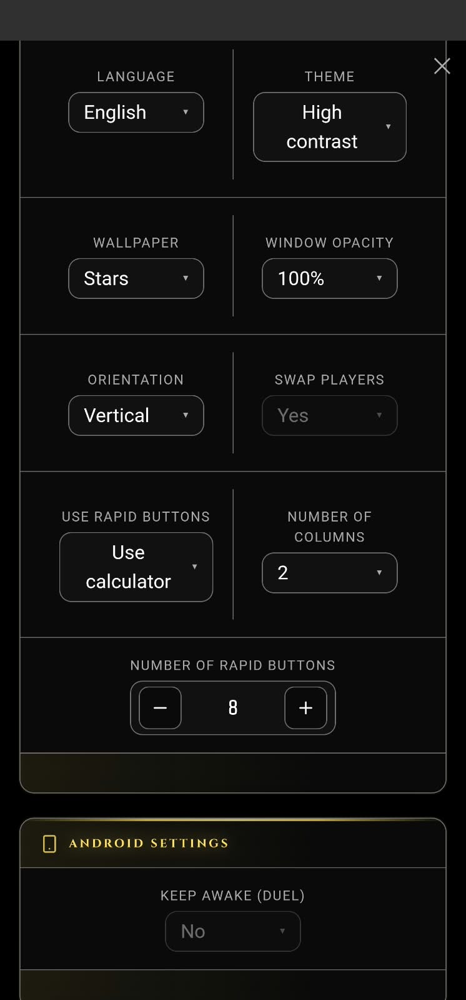

# leuDuel

> leuDuel is simple YGO Duel companion that comes with everything you may need for a duel! It is made in Angular + Capacitor.

> Kindly notice that this is an Hobby project

[](#license)
[](#supported-platforms)
[](#distribution)
[](#distribution)

---


## ✨ Features

### Basic features
* Life Points counter for both players (with quick undo)
* Match timer
* Win counter
* Undo last damage taken
* Quick damage buttons 
* LP Calculator

### Other features/tools
* Full logs of taken damage (unduable)
* Counters (On MR5 field siluhette)
* D6 Dice Roll
* Coin flip
* Card search for quick ruling (YGO PRO API)

### Features customization
* Mute mode
* Custom profile for duelists (Names + Card picture) 
* Timer customization
* LP Customization
* Quick damage buttons customization
* LP Calculator / Quick damage buttons preference
* Personalize some application behaviours for automatization
* Keep awake for Android

### Interface customization
* Screen orientation preference (With player swap)
* Language customization (wip)
* Themes available (Light - Dark - High contrast) and modal window opacity
* Simple live wallpapers


### Duel Persistence

Duel state and user preferences are persisted on the device using capacitor's preferences.
Any action is saved immediately to ensure nothing is lost

---

## 🖼️ Screenshots

<table>
    <tr>
        <td></td>
        <td></td>
        <td></td>
    </tr>
    <tr>
        <td></td>
        <td></td>
        <td></td>
    </tr>
</table>
<table>
    <tr>
        <td></td>
        <td></td>
    </tr>
</table>

<table>
    <tr>
        <td></td>
        <td></td>
        <td></td>
    </tr>
</table>

---

## 📦 Supported Platforms

### Android

Requires Android 7.0 (API level 24) or higher.

### iOS

> iOS support is not currently available.

---

## 📥 Distribution

The application is intended to be distributed through:

* **F-Droid:** Planned
* **Google Play:** Planned
* **Apple App Store:** Not planned

---

## 🔒 Privacy & Data

This application does **not operate a server-side backend** for storing user data.

### Local Data

All data is stored exclusively on the user's device using Capacitor Preferences (key-value storage). This includes:

* Application preferences and settings
* Duel state (life points, timers, win counters)
* Duelist profiles

No data ever leaves the device except for card search queries (see below).

### Data Sent to Third Parties

The only external communication is card name/search queries sent to the YGO Pro API when using the card search feature. No personal or user-identifying information is ever included in these requests.

---

## 🌐 External Services

### YGO Pro API

Used for in-app card search to assist with quick rulings during a duel.

* Purpose: Card search by name and filters
* Data sent: Card name and search query only
* Data received: Card information (name, type, description, card information and images)
* API documentation: https://ygoprodeck.com/api-guide/
* Terms/license: https://ygoprodeck.com/api-guide/

This application does not host or redistribute card data. All card data is fetched on demand and not persisted locally.

Duelist profiles can associate to a card image for personalization, but the application does not store or transmit any card images. Images are loaded directly from the YGO Pro API when needed.

---

## 🔊 Sounds & Other Assets

### Audio Sources

> Audio resources are currently self made LMMS and there's definitely room for improvements.

### Yu-Gi-Oh! Related Material

> This project is not affiliated with, endorsed by, or sponsored by Konami or any Yu-Gi-Oh! rights holders.

---

## 🛠️ Technology Stack

* **Frontend:** Angular 22
* **Language:** TypeScript 6
* **Mobile runtime:** Capacitor 8
* **Android:** minSdk 24 / targetSdk 36 / Gradle 8.13.0
* **Package manager:** npm 11.19.0
* **State management:** NgRx Signals 22
* **Styling:** Tailwind CSS 4
* **External API:** YGO Pro API (ygoprodeck.com)

---

# 💻 Development

## 🐳 Development Environment

This project is developed using **Dev Containers** to provide a consistent and reproducible development environment without filling host machine OS with dependencies.

### Requirements

* Docker (Desktop or Engine)
* Visual Studio Code
* Dev Containers extension `ms-vscode-remote.remote-containers`

> The project has been fully developed on Windows 11. The dev container has not been tested on other operating systems, but feel free to experiment and suggest improvements.

### Starting the Development Container

Dev containers are containerized development environment, you can execute them on VSCode after installing Docker on your machine and the VSCode extension
``ms-vscode-remote.remote-containers``

Configuration is available under\
```text
/.devcontainer/devcontainer.json
```

### Development Container

Development container includes the following features

* Node.js
* npm / package manager
* Angular CLI
* Project dependencies
* Prettier code linter
* VSCode extensions


---

## 🧑‍💻 Running the Application

### Install Dependencies

```bash
npm install
```

### Run the Angular Development Server

```bash
npm run start
```

---

## 🐳 Android Build Container

### Android Build Environment

The Android build environment contains:

* Android SDK
* Android build tools
* Java/JDK
* Gradle
* Capacitor Android tooling


### Requirements

* Docker

### Build APK

```bash
docker compose -f docker-compose.android.yml up --build --remove-orphans
```
(see build-android.bat)

### Output APK

```text
/output/leuduel-debug.apk
```

## 🚀 Android Release Build

* Google play release is in progress.

> **Security:** Never commit release keystores, signing passwords, API keys, or other secrets to the repository.

# 🏗️ Release & Distribution

## F-Droid

Planned. Not yet published.

## Google Play

Planned. Not yet published.

---

# 🤝 Contributing

Contributions are welcome!

## Reporting Bugs

You can report bugs by contacting me on Discord or opening an issue here on github, feel free to blame me for anything!

Please include:
* Steps to reproduce
* Expected behavior
* Actual behavior
* Relevant information or screenshots if possible

## Feature Requests

Open an issue on GitHub or reach out on Discord.

---

# 🐛 Known Issues

* - currently none

See [Issues](https://github.com/XimTheCookie/LeuDuel/issues) for current bugs and feature requests.

---

# 🗺️ Roadmap

* [ ] Complete Android release build
* [ ] F-Droid release
* [ ] Google Play release
* [ ] iOS support

---

# ☕ Support the Project

If you find this project useful and would like to support me:


* Buy me a coffee: [https://www.buymeacoffee.com/ximthecookie](https://www.buymeacoffee.com/ximthecookie)

---

# 📄 License

LeuDuel's original source code is licensed under the [MIT License](LICENSE).

This does not cover third-party software, services, or Yu-Gi-Oh!-related
names, images, and data, which may have separate terms.

## Third-Party Credits

This project uses third-party libraries, services, and assets that may be distributed under their own licenses.

* [Lucide Icons](https://lucide.dev/)
* [Tailwind CSS](https://tailwindcss.com/)
* [Angular](https://angular.dev/)
* [Capacitor](https://capacitorjs.com/)
* [RxJS](https://rxjs.dev/)
* [NgRx Signals](https://ngrx.io/guide/signals)
* [Prettier](https://prettier.io/)
* [YGO Pro API](https://ygoprodeck.com/api-guide/)

# ⚠️ Disclaimer

This project is an independent open-source project and is not affiliated with, endorsed by, or sponsored by Konami or any other Yu-Gi-Oh! rights holders.

---

# 📬 Contact

* [GitHub](https://github.com/XimTheCookie/LeuDuel)
* [Issues](https://github.com/XimTheCookie/LeuDuel/issues)
* [Discord](https://discord.gg/cPk4MKHQmp)

---

**leuDuel**
